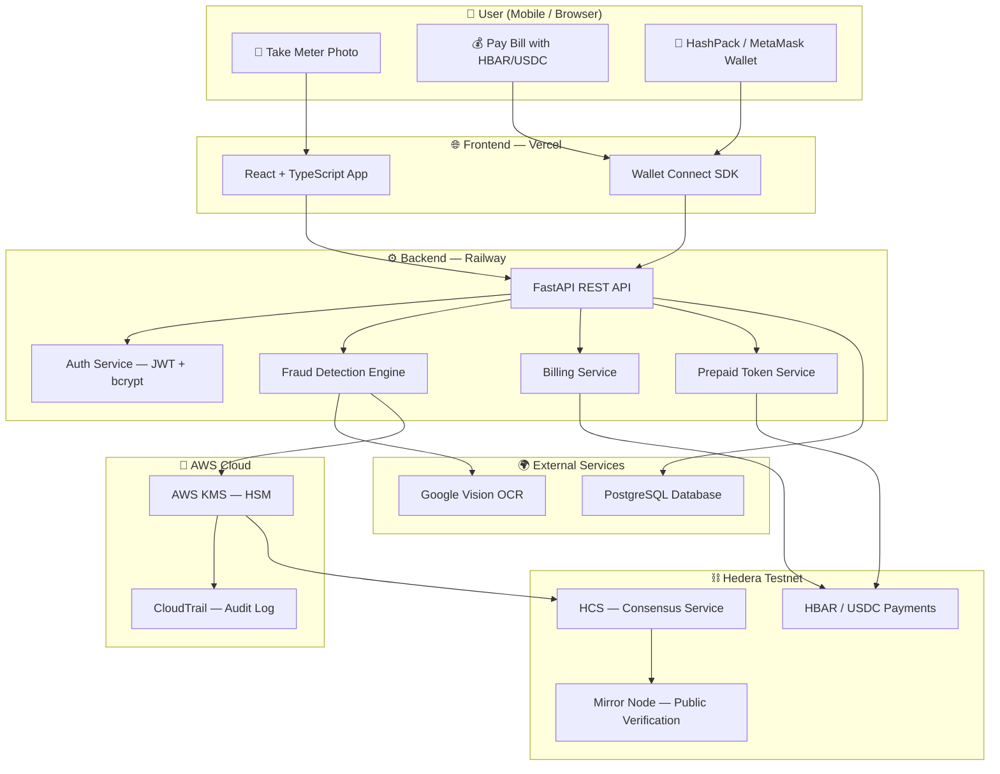
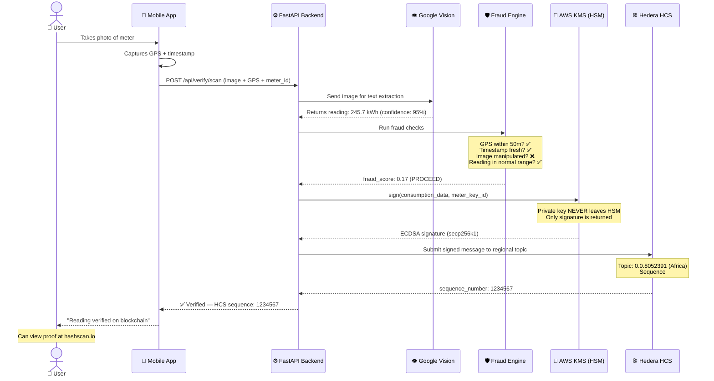
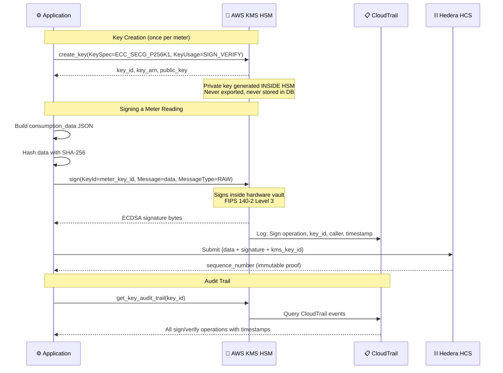
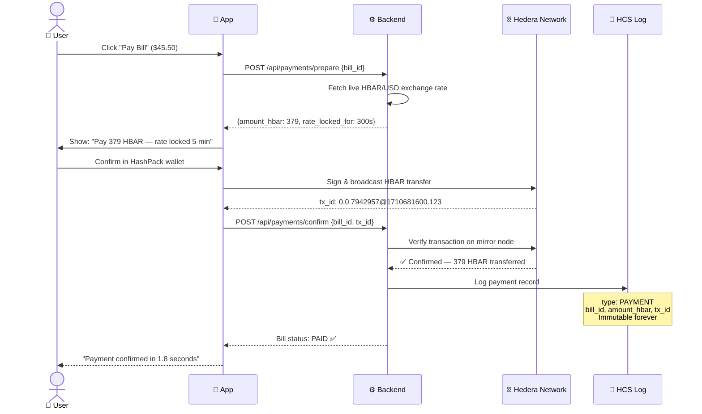
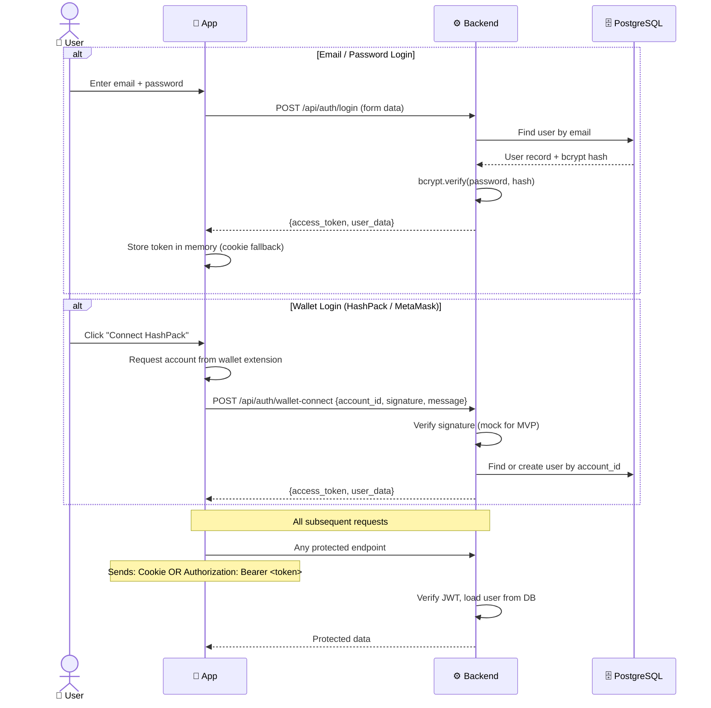
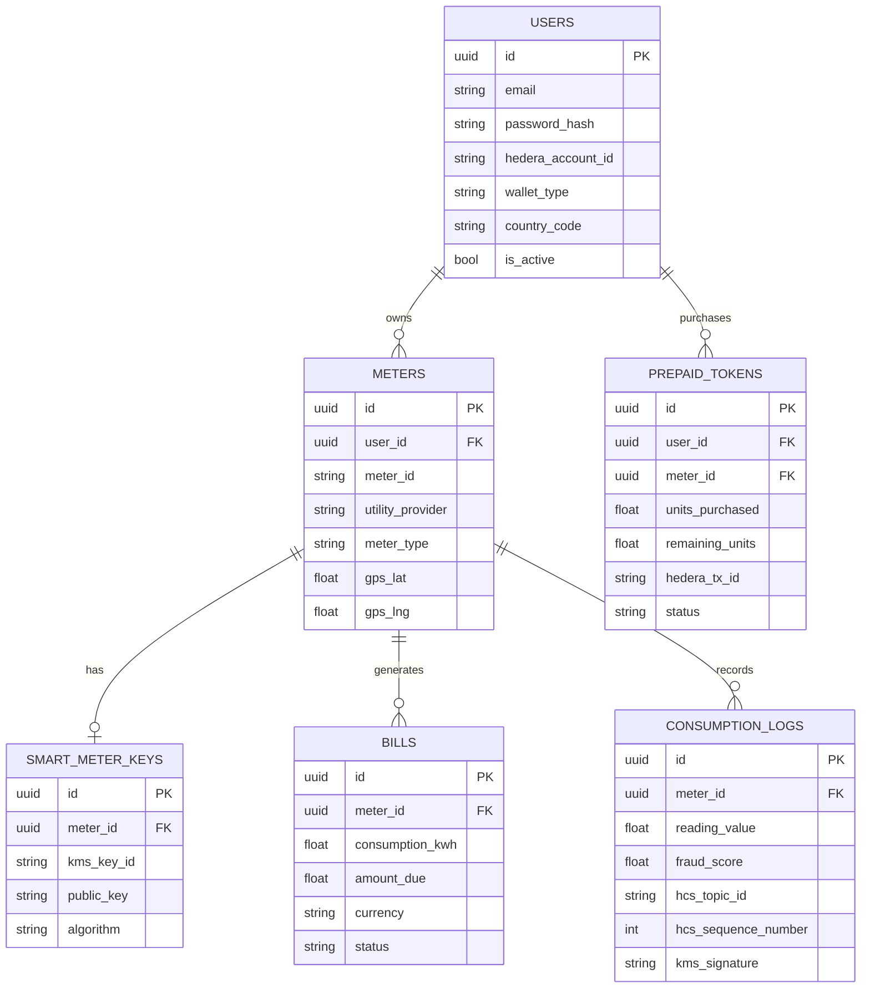
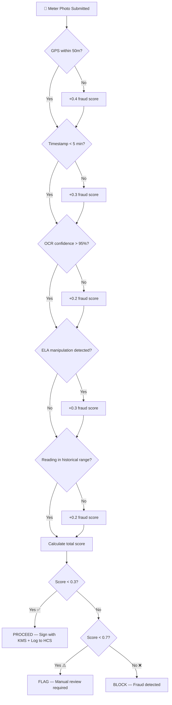
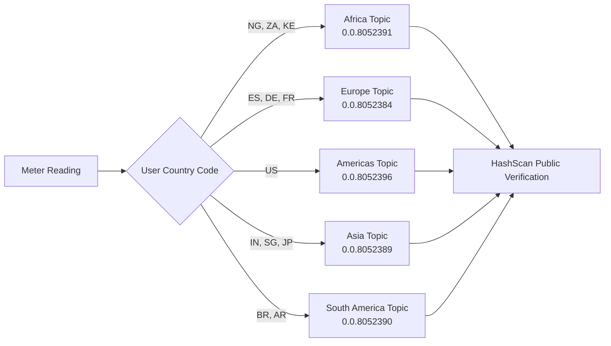

# Hedera Flow — Architecture & Flow Diagrams

## System Overview

Hedera Flow connects three worlds: **physical meters**, **cloud security (AWS KMS)**, and **blockchain (Hedera)**. Here's how they fit together.

---

## 1. Full System Architecture

---

## 2. Meter Reading & Verification Flow

Step-by-step: from photo to blockchain record.

---

## 3. AWS KMS Signing Flow (Detailed)

This is the security core — how we ensure private keys never touch application memory.

---

## 4. Payment Flow (HBAR / USDC)

---

## 5. Authentication Flow

---

## 6. Database Schema (Key Tables)

---

## 7. Fraud Detection Decision Tree

---

## 8. Regional HCS Topic Routing

