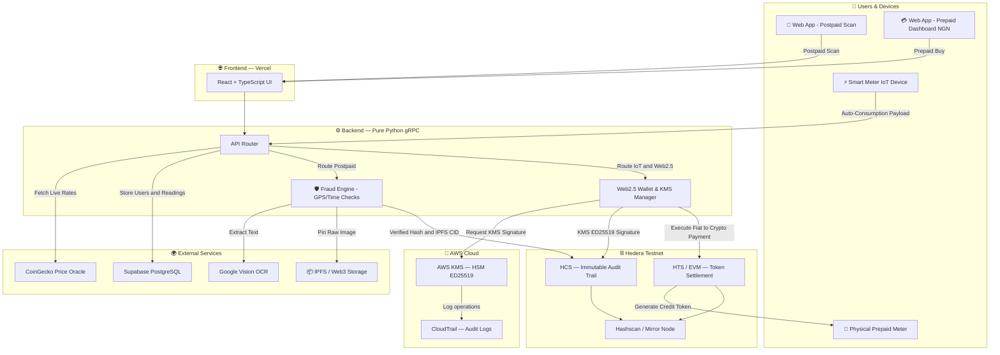
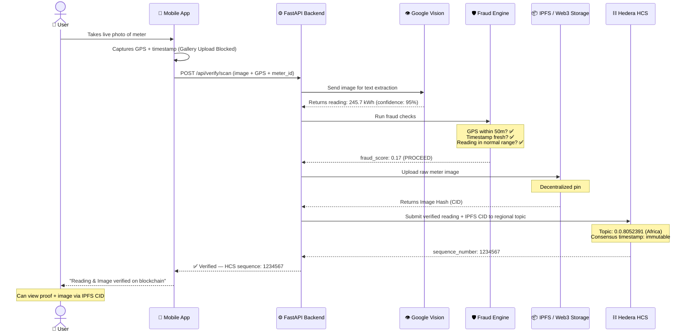
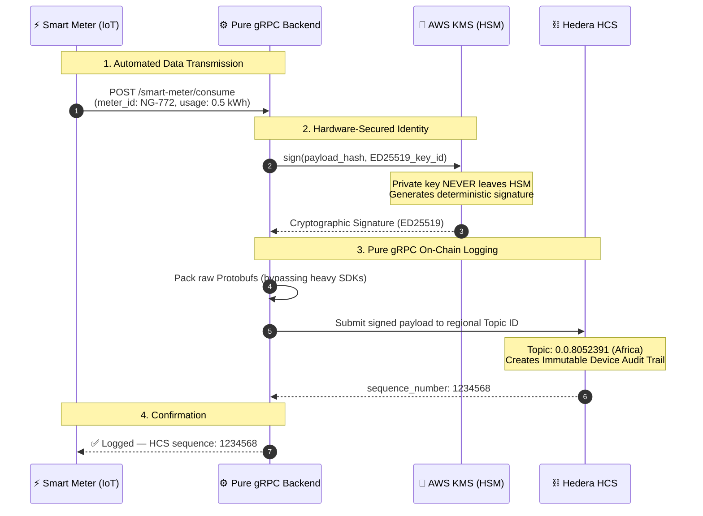
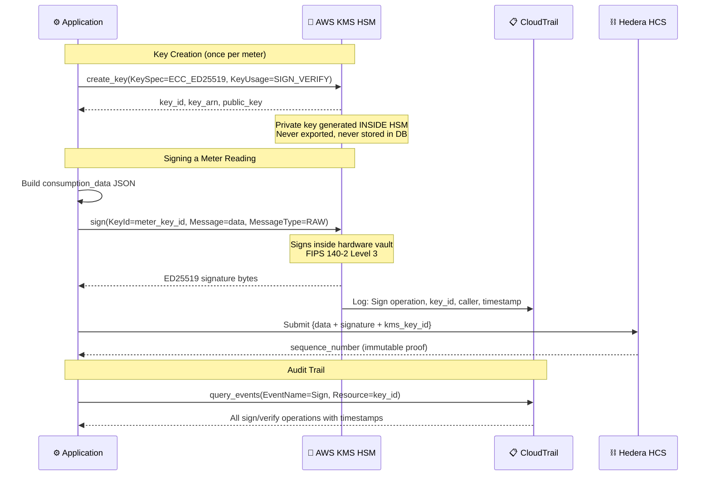
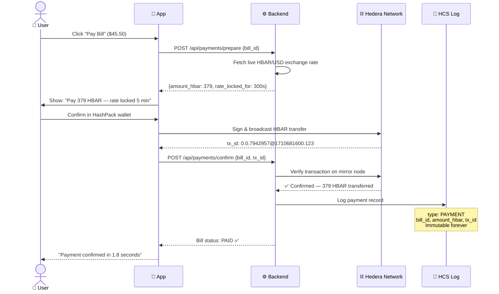
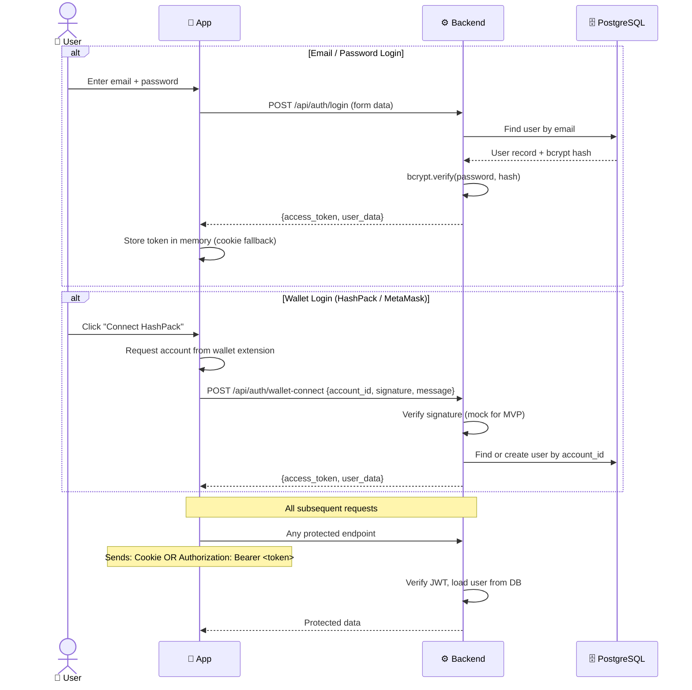
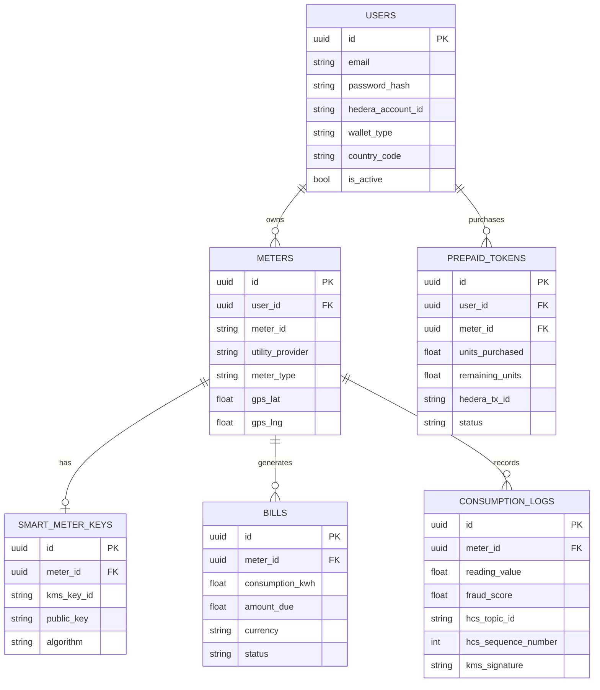
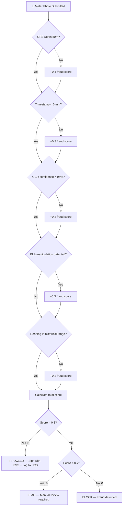
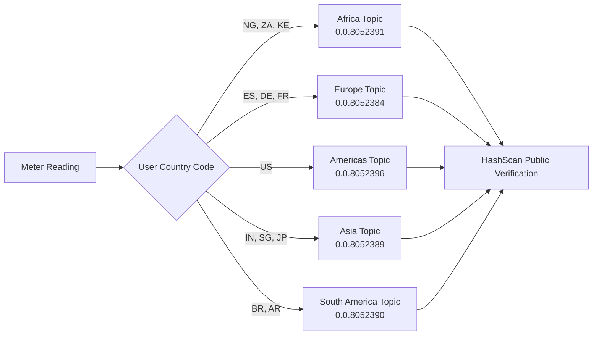

# Hedera Flow — Architecture & Flow Diagrams

## System Overview

Hedera Flow connects three worlds: **physical meters**, **cloud security (AWS KMS)**, and **blockchain (Hedera)**. Here's how they fit together.

---

## 1. Full System Architecture

```mermaid
graph TB
    subgraph CLIENTS["👥 Users & Devices"]
        A[📱 Web App - Postpaid Scan]
        B[💳 Web App - Prepaid Dashboard NGN]
        PM[🔢 Physical Prepaid Meter]
        IoT[⚡ Smart Meter IoT Device]
    end

    subgraph FRONTEND["🌐 Frontend — Vercel"]
        D[React + TypeScript UI]
    end

    subgraph BACKEND["⚙️ Backend — Pure Python gRPC"]
        F[API Router]
        H[🛡️ Fraud Engine - GPS/Time Checks]
        W[Web2.5 Wallet & KMS Manager]
    end

    subgraph AWS["🔐 AWS Cloud"]
        K[AWS KMS — HSM ED25519]
        L[CloudTrail — Audit Logs]
    end

    subgraph EXTERNAL["🌍 External Services"]
        P[Google Vision OCR]
        Q[Supabase PostgreSQL]
        R[📦 IPFS / Web3 Storage]
        S[CoinGecko Price Oracle]
    end

    subgraph HEDERA["⛓️ Hedera Testnet"]
        M[HCS — Immutable Audit Trail]
        N[HTS / EVM — Token Settlement]
        O[Hashscan / Mirror Node]
    end

    %% Client Connections
    A -->|Postpaid Scan| D
    B -->|Prepaid Buy| D
    IoT -->|Auto-Consumption Payload| F

    D --> F

    %% Backend Routing
    F -->|Fetch Live Rates| S
    F -->|Store Users and Readings| Q
    F -->|Route Postpaid| H
    
    %% Postpaid/Legacy Flow
    H -->|Extract Text| P
    H -->|Pin Raw Image| R
    H -->|Verified Hash and IPFS CID| M

    %% KMS / Smart Meter / Web2.5 Flow
    F -->|Route IoT and Web2.5| W
    W -->|Request KMS Signature| K
    K -->|Log operations| L
    W -->|KMS ED25519 Signature| M
    
    %% Prepaid Flow
    W -->|Execute Fiat to Crypto Payment| N
    N -->|Generate Credit Token| PM

    %% Public Verification
    M --> O
    N --> O


```

---

## 2. Meter Reading & Verification Flow

Step-by-step: from photo to blockchain record.

```mermaid
sequenceDiagram
    actor User as 👤 User
    participant App as 📱 Mobile App
    participant API as ⚙️ FastAPI Backend
    participant OCR as 👁️ Google Vision
    participant Fraud as 🛡️ Fraud Engine
    participant IPFS as 📦 IPFS / Web3 Storage
    participant HCS as ⛓️ Hedera HCS

    User->>App: Takes live photo of meter
    App->>App: Captures GPS + timestamp (Gallery Upload Blocked)
    App->>API: POST /api/verify/scan (image + GPS + meter_id)

    API->>OCR: Send image for text extraction
    OCR-->>API: Returns reading: 245.7 kWh (confidence: 95%)

    API->>Fraud: Run fraud checks
    Note over Fraud: GPS within 50m? ✅<br/>Timestamp fresh? ✅<br/>Reading in normal range? ✅
    Fraud-->>API: fraud_score: 0.17 (PROCEED)

    API->>IPFS: Upload raw meter image
    Note over IPFS: Decentralized pin
    IPFS-->>API: Returns Image Hash (CID)

    API->>HCS: Submit verified reading + IPFS CID to regional topic
    Note over HCS: Topic: 0.0.8052391 (Africa)<br/>Consensus timestamp: immutable
    HCS-->>API: sequence_number: 1234567

    API-->>App: ✅ Verified — HCS sequence: 1234567
    App-->>User: "Reading & Image verified on blockchain"
    Note over User: Can view proof + image via IPFS CID

```
---

## 3. Smart Meter & AWS KMS Verification Flow

For smart meters that lack secure hardware, Hedera Flow abstracts key management by securely signing consumption data using AWS KMS. Our pure Python backend then routes this KMS-signed payload directly to the Hedera Consensus Service (HCS). This creates an automated, tamper-proof billing trail for IoT infrastructure without exposing private keys.

```mermaid
sequenceDiagram
    autonumber
    participant Meter as ⚡ Smart Meter (IoT)
    participant API as ⚙️ Pure gRPC Backend
    participant KMS as 🔐 AWS KMS (HSM)
    participant HCS as ⛓️ Hedera HCS

    Note over Meter,API: 1. Automated Data Transmission
    Meter->>API: POST /smart-meter/consume <br/> (meter_id: NG-772, usage: 0.5 kWh)
    
    Note over API,KMS: 2. Hardware-Secured Identity
    API->>KMS: sign(payload_hash, ED25519_key_id)
    Note over KMS: Private key NEVER leaves HSM<br/>Generates deterministic signature
    KMS-->>API: Cryptographic Signature (ED25519)

    Note over API,HCS: 3. Pure gRPC On-Chain Logging
    API->>API: Pack raw Protobufs (bypassing heavy SDKs)
    API->>HCS: Submit signed payload to regional Topic ID
    Note over HCS: Topic: 0.0.8052391 (Africa)<br/>Creates Immutable Device Audit Trail
    HCS-->>API: sequence_number: 1234568

    Note over API,Meter: 4. Confirmation
    API-->>Meter: ✅ Logged — HCS sequence: 1234568

```

---

## 4. AWS KMS Signing Flow (Detailed)

This is the security core — how we ensure private keys never touch application memory.

```mermaid
sequenceDiagram
    participant App as ⚙️ Application
    participant KMS as 🔐 AWS KMS HSM
    participant CT as 📋 CloudTrail
    participant HCS as ⛓️ Hedera HCS

    Note over App,KMS: Key Creation (once per meter)
    App->>KMS: create_key(KeySpec=ECC_ED25519, KeyUsage=SIGN_VERIFY)
    KMS-->>App: key_id, key_arn, public_key
    Note over KMS: Private key generated INSIDE HSM<br/>Never exported, never stored in DB

    Note over App,KMS: Signing a Meter Reading
    App->>App: Build consumption_data JSON
    App->>KMS: sign(KeyId=meter_key_id, Message=data, MessageType=RAW)
    Note over KMS: Signs inside hardware vault<br/>FIPS 140-2 Level 3
    KMS-->>App: ED25519 signature bytes
    KMS->>CT: Log: Sign operation, key_id, caller, timestamp

    App->>HCS: Submit {data + signature + kms_key_id}
    HCS-->>App: sequence_number (immutable proof)

    Note over App,CT: Audit Trail
    App->>CT: query_events(EventName=Sign, Resource=key_id)
    CT-->>App: All sign/verify operations with timestamps

```

---

## 5. Payment Flow (HBAR / USDC)

```mermaid
sequenceDiagram
    actor User as 👤 User
    participant App as 📱 App
    participant API as ⚙️ Backend
    participant Hedera as ⛓️ Hedera Network
    participant HCS as 📝 HCS Log

    User->>App: Click "Pay Bill" ($45.50)
    App->>API: POST /api/payments/prepare {bill_id}
    API->>API: Fetch live HBAR/USD exchange rate
    API-->>App: {amount_hbar: 379, rate_locked_for: 300s}

    App->>User: Show: "Pay 379 HBAR — rate locked 5 min"
    User->>App: Confirm in HashPack wallet
    App->>Hedera: Sign & broadcast HBAR transfer
    Hedera-->>App: tx_id: 0.0.7942957@1710681600.123

    App->>API: POST /api/payments/confirm {bill_id, tx_id}
    API->>Hedera: Verify transaction on mirror node
    Hedera-->>API: ✅ Confirmed — 379 HBAR transferred

    API->>HCS: Log payment record
    Note over HCS: type: PAYMENT<br/>bill_id, amount_hbar, tx_id<br/>Immutable forever

    API-->>App: Bill status: PAID ✅
    App-->>User: "Payment confirmed in 1.8 seconds"
```

---

## 6. Authentication Flow

```mermaid
sequenceDiagram
    actor User as 👤 User
    participant App as 📱 App
    participant API as ⚙️ Backend
    participant DB as 🗄️ PostgreSQL

    alt Email / Password Login
        User->>App: Enter email + password
        App->>API: POST /api/auth/login (form data)
        API->>DB: Find user by email
        DB-->>API: User record + bcrypt hash
        API->>API: bcrypt.verify(password, hash)
        API-->>App: {access_token, user_data}
        App->>App: Store token in memory (cookie fallback)
    end

    alt Wallet Login (HashPack / MetaMask)
        User->>App: Click "Connect HashPack"
        App->>App: Request account from wallet extension
        App->>API: POST /api/auth/wallet-connect {account_id, signature, message}
        API->>API: Verify signature (mock for MVP)
        API->>DB: Find or create user by account_id
        API-->>App: {access_token, user_data}
    end

    Note over App,API: All subsequent requests
    App->>API: Any protected endpoint
    Note over App: Sends: Cookie OR Authorization: Bearer <token>
    API->>API: Verify JWT, load user from DB
    API-->>App: Protected data
```

---

## 7. Database Schema (Key Tables)

```mermaid
erDiagram
    USERS {
        uuid id PK
        string email
        string password_hash
        string hedera_account_id
        string wallet_type
        string country_code
        bool is_active
    }

    METERS {
        uuid id PK
        uuid user_id FK
        string meter_id
        string utility_provider
        string meter_type
        float gps_lat
        float gps_lng
    }

    SMART_METER_KEYS {
        uuid id PK
        uuid meter_id FK
        string kms_key_id
        string public_key
        string algorithm
    }

    BILLS {
        uuid id PK
        uuid meter_id FK
        float consumption_kwh
        float amount_due
        string currency
        string status
    }

    PREPAID_TOKENS {
        uuid id PK
        uuid user_id FK
        uuid meter_id FK
        float units_purchased
        float remaining_units
        string hedera_tx_id
        string status
    }

    CONSUMPTION_LOGS {
        uuid id PK
        uuid meter_id FK
        float reading_value
        float fraud_score
        string hcs_topic_id
        int hcs_sequence_number
        string kms_signature
    }

    USERS ||--o{ METERS : owns
    METERS ||--o| SMART_METER_KEYS : has
    METERS ||--o{ BILLS : generates
    USERS ||--o{ PREPAID_TOKENS : purchases
    METERS ||--o{ CONSUMPTION_LOGS : records
```

---

## 8. Fraud Detection Decision Tree

```mermaid
flowchart TD
    A[📸 Meter Photo Submitted] --> B{GPS within 50m?}
    B -->|No| C[+0.4 fraud score]
    B -->|Yes| D{Timestamp < 5 min?}
    C --> D
    D -->|No| E[+0.3 fraud score]
    D -->|Yes| F{OCR confidence > 95%?}
    E --> F
    F -->|No| G[+0.2 fraud score]
    F -->|Yes| H{ELA manipulation detected?}
    G --> H
    H -->|Yes| I[+0.3 fraud score]
    H -->|No| J{Reading in historical range?}
    I --> J
    J -->|No| K[+0.2 fraud score]
    J -->|Yes| L[Calculate total score]
    K --> L

    L --> M{Score < 0.3?}
    M -->|Yes ✅| N[PROCEED — Sign with KMS + Log to HCS]
    M -->|No| O{Score < 0.7?}
    O -->|Yes ⚠️| P[FLAG — Manual review required]
    O -->|No ❌| Q[BLOCK — Fraud detected]
```

---

## 9. Regional HCS Topic Routing

```mermaid
flowchart LR
    A[Meter Reading] --> B{User Country Code}
    B -->|NG, ZA, KE| C[Africa Topic<br/>0.0.8052391]
    B -->|ES, DE, FR| D[Europe Topic<br/>0.0.8052384]
    B -->|US| E[Americas Topic<br/>0.0.8052396]
    B -->|IN, SG, JP| F[Asia Topic<br/>0.0.8052389]
    B -->|BR, AR| G[South America Topic<br/>0.0.8052390]

    C --> H[HashScan Public Verification]
    D --> H
    E --> H
    F --> H
    G --> H
```
