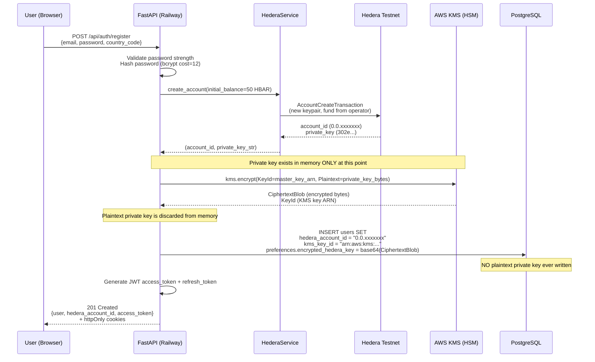
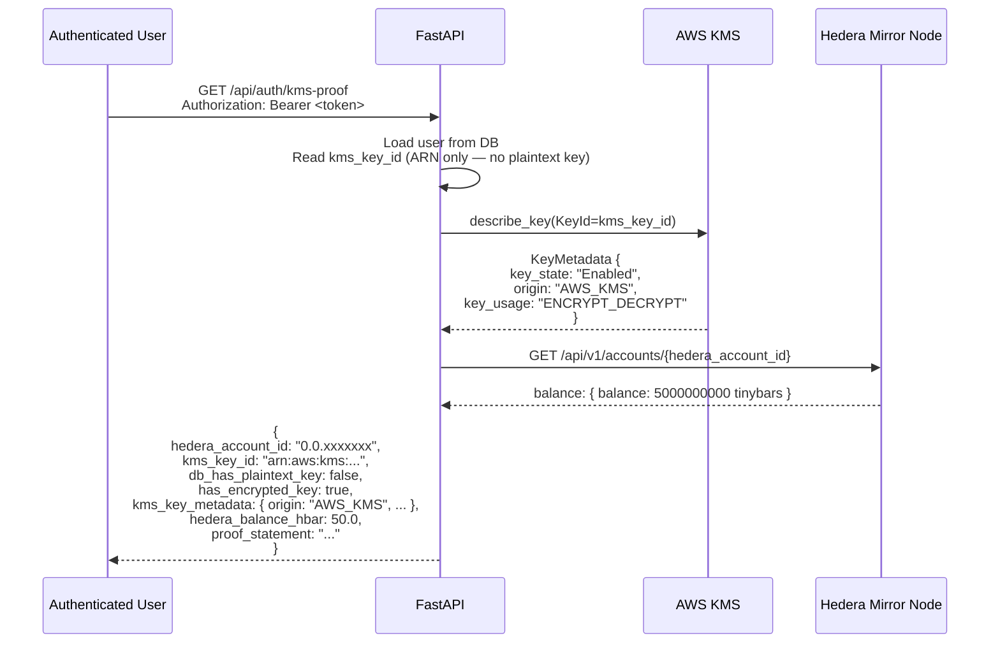
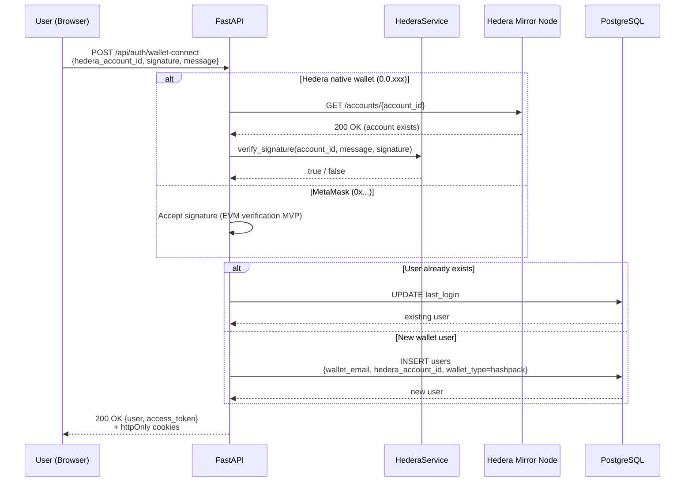
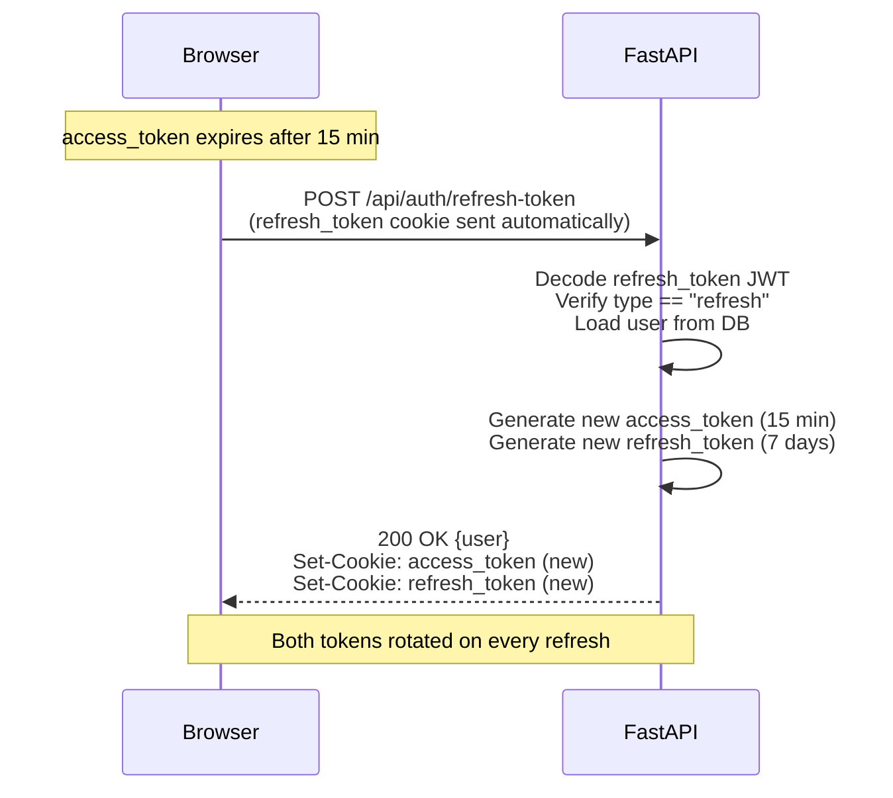
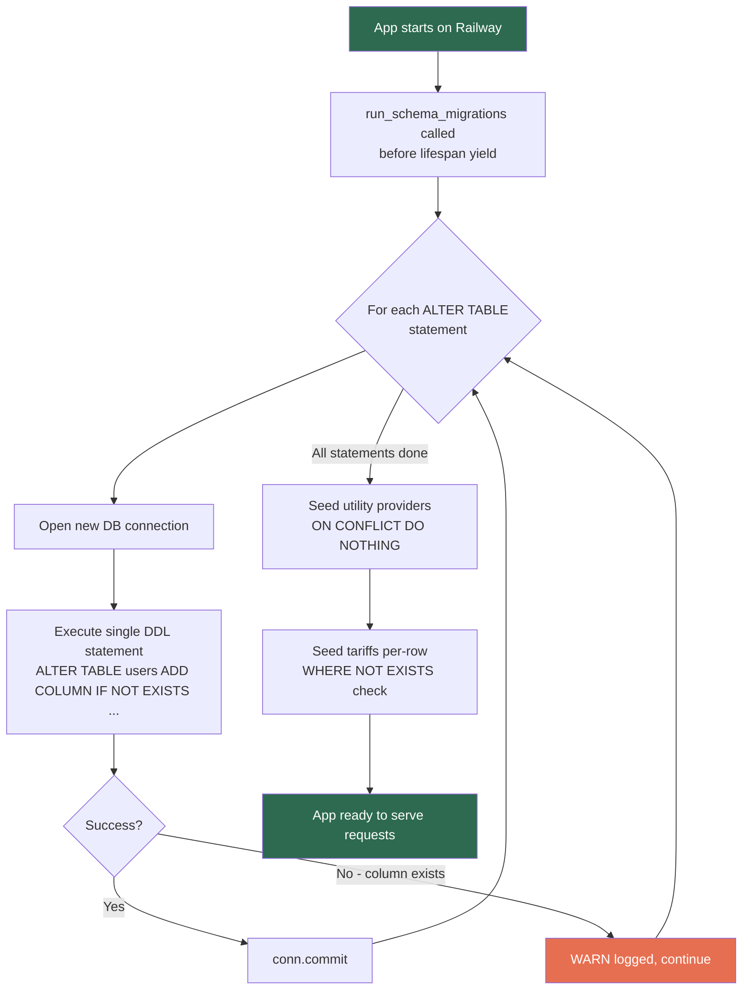
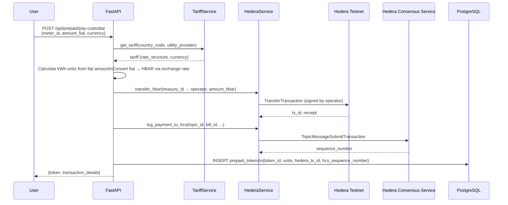
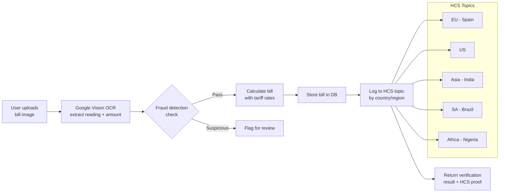

# Custodial Wallet & AWS KMS Key Management

This document covers the end-to-end implementation of custodial Hedera account creation, 50 HBAR airdrop, and AWS KMS-backed private key storage in Hedera Flow.

---

## Overview

When a user registers without an existing wallet, the platform automatically:

1. Creates a real Hedera testnet account via the Hedera SDK
2. Funds it with **50 HBAR** from the operator treasury (`0.0.7942971`)
3. Encrypts the new account's private key inside **AWS KMS** (HSM-backed)
4. Stores only the **KMS key ARN** in the database — the plaintext private key never touches the DB or logs

---

## Registration Flow



---

## KMS Proof Endpoint

`GET /api/auth/kms-proof` (requires auth) returns live evidence that the key is in KMS, not the DB.



---

## Wallet Connect Flow (Existing Wallet)

Users with HashPack or MetaMask skip account creation entirely.



---

## Token Refresh & Session Management



---

## Schema Migration Strategy

Railway's PostgreSQL doesn't auto-apply model changes. The app runs migrations on every startup.



**Why individual statements?** psycopg2 aborts the entire transaction on any error. Batching multiple `ALTER TABLE` statements in one `execute()` call means a single "column already exists" error kills all subsequent migrations. Each statement gets its own connection and commit.

**Emergency fix endpoint:** `POST /api/health/fix-schema` runs the same statements and returns which columns now exist — useful immediately after a deploy if Railway logs show `UndefinedColumn`.

---

## Prepaid Token Purchase Flow



---

## Bill Verification (OCR + Hedera)



---

## Security Properties

| Property | Implementation |
|---|---|
| Private key never in DB | Only `kms_key_id` (ARN) stored; ciphertext in `preferences.encrypted_hedera_key` |
| Private key never in logs | Discarded from memory immediately after KMS encrypt call |
| Key material in HSM | KMS `origin: "AWS_KMS"` — key material generated and stored in FIPS 140-2 Level 3 HSM |
| Audit trail | Every KMS operation logged in AWS CloudTrail |
| Token expiry | Access tokens: 15 min · Refresh tokens: 7 days · Both rotated on refresh |
| Cookie security | `httpOnly=True`, `secure=True`, `samesite=none` on Railway (HTTPS) |
| Password hashing | bcrypt cost factor 12 |
| Fallback on SDK failure | Account marked `0.0.PENDING_xxxx` — user can link wallet later |

---

## Environment Variables Required

```env
# Hedera
HEDERA_NETWORK=testnet
HEDERA_OPERATOR_ID=0.0.xxxxxxx
HEDERA_OPERATOR_KEY=302e...
HEDERA_TREASURY_ID=0.0.7942971

# AWS KMS
AWS_KMS_REGION=us-east-1
AWS_KMS_MASTER_KEY_ID=arn:aws:kms:us-east-1:...

# HCS Topics (per region)
HCS_TOPIC_EU=0.0.xxxxxxx
HCS_TOPIC_US=0.0.xxxxxxx
HCS_TOPIC_ASIA=0.0.xxxxxxx
HCS_TOPIC_SA=0.0.xxxxxxx
HCS_TOPIC_AFRICA=0.0.xxxxxxx
```

---

## Existing Users

Users registered before this implementation have `evm_address = NULL` and `kms_key_id = NULL`. They can still log in normally. To get a custodial Hedera account they can:

- Re-register (new account)
- Use `PATCH /api/auth/link-wallet` to attach an existing HashPack/MetaMask wallet

Backfilling existing users with new Hedera accounts requires a separate migration script and is not done automatically.
