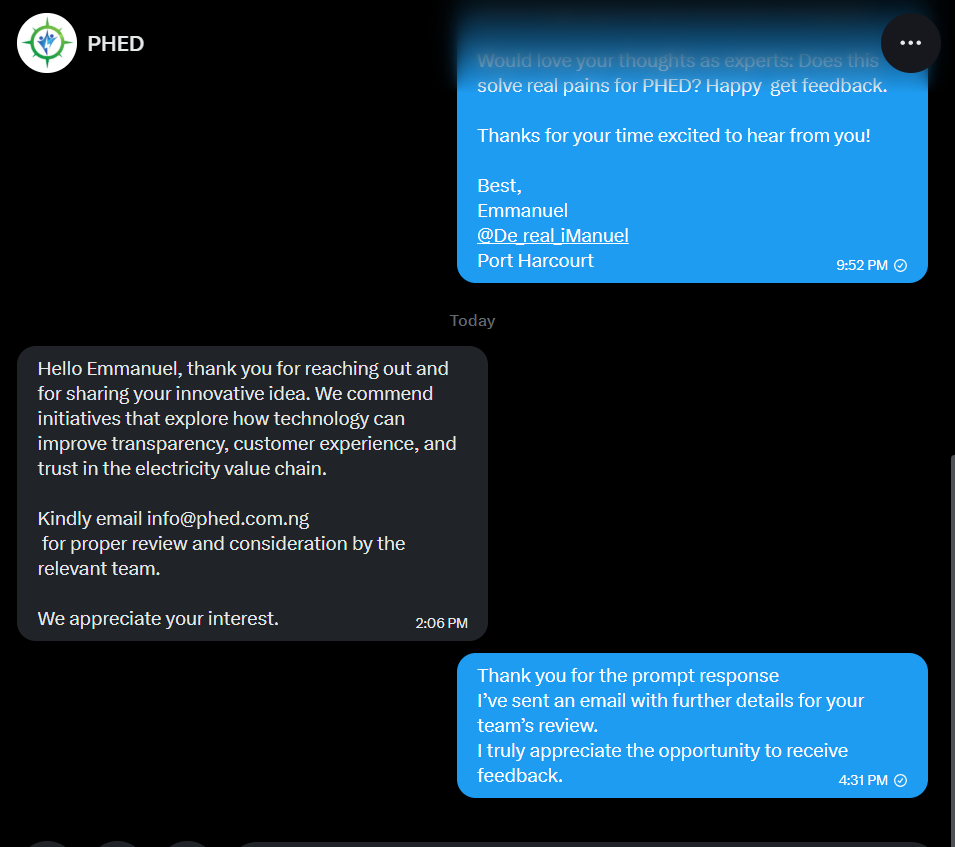

# Hedera Flow — Hackathon PRD

---

## 1. Problem Statement

> What problem are you solving? Why does it matter?

Across emerging markets, electricity utilities lose billions annually due to billing errors, electricity theft, and non-technical losses. Millions of consumers receive estimated bills instead of actual meter readings, leading to frequent disputes.

When disputes arise:
- Consumers lack verifiable proof
- Utilities lack trusted, tamper-proof data
- Disputes remain unresolved
- Trust completely breaks down

**Target Users**: Everyday electricity consumers (e.g., households in Nigeria facing estimated billing) and utility providers dealing with revenue leakage and fraud.

**Current Solutions**: Manual meter reading (prone to human error and manipulation) and estimated billing systems (opaque and inaccurate).

**Why Web3?**: A centralized system forces users to trust the utility provider. Hedera provides a neutral, immutable ledger where meter readings cannot be altered, both parties share a single source of truth, and trust is enforced by consensus — not authority.

---

## 2. Solution Overview

> How does your project solve this problem?

Hedera Flow is a decentralized verification layer for electricity billing. It creates a secure pipeline:

**Physical Meter → AI Capture → Cryptographic Signing → Hedera → Verification Dashboard**

We:
- Capture meter readings using AI-OCR
- Secure data using AWS KMS
- Log immutable proofs on Hedera Consensus Service (HCS)
- Enable transparent verification and future automated payments

**Hackathon Track Alignment**: Hedera Integration (HCS, HTS, EVM) + AWS KMS (secure key management)

### Key Features (MVP)

1. **AI-OCR Verification** — Extracts readings from physical meters to eliminate manual fraud
2. **Secure Key Signing (AWS KMS)** — Transactions are signed in a hardware-secured environment
3. **Hedera HCS Logging** — Immutable, timestamped audit trail of every reading

### Non-Goals (v1)

- No custom hardware (software-first approach)
- No full mainnet rollout yet (testnet focus)
- No complex token economy in v1

---

## 3. Hedera Integration Architecture

> How does your solution leverage the Hedera network?

### Network Services Used

| Service | Purpose | Why This Service? |
|---------|---------|-------------------|
| HCS | Log meter readings | Cheap, immutable, ordered consensus |
| HTS | Energy credits (future) | Native tokenization for micro-payments |
| EVM | Billing automation | Smart contract-based settlement |

### Ecosystem Integrations

| Partner/Platform | Integration Type | Value Added |
|-----------------|------------------|-------------|
| AWS KMS | Key management | Secure transaction signing |
| ZetaChain (Planned) | Omnichain payments | Pay with BTC, ETH, USDT |

### Architecture Diagram

```
Physical Meter
     ↓
AI-OCR Capture
     ↓
AWS KMS (Signing)
     ↓
Hedera HCS (Immutable Log)
     ↓
Frontend Dashboard (Verification)
```

---

## 4. Hedera Network Impact

> How does your solution grow the Hedera ecosystem?

### Account Creation
- Web2 users onboarded through simple UX (no deep crypto knowledge required)
- Estimated accounts: **1,000+ in pilot phase**

### Active Accounts
- Electricity billing is recurring → high retention
- Estimated: monthly active usage per meter

### Transactions Per Second (TPS)
- Each reading = 1 HCS transaction
- 500 users → ~15,000 tx/month
- At scale → millions of transactions

### Audience Exposure
- Targets emerging markets (Africa, Asia)
- Potential reach: hundreds of millions of users

---

## 5. Innovation & Differentiation

> What makes this solution unique?

### Ecosystem Gap
Bridges physical infrastructure (meters) with Web3 — without requiring expensive smart meter upgrades.

### Cross-Chain Comparison
- Ethereum: high fees, slower finality
- Hedera: aBFT security, ultra-low fees, high throughput — perfect for IoT + micro-transactions

### Novel Hedera Usage
- Regional HCS topics for compliance
- OCR + blockchain bridge (no hardware dependency)
- Foundation for future DePIN infrastructure

---

## 6. Feasibility & Business Model

> Can this be built and sustained?

### Technical Feasibility
- **Stack**: Python, OCR, Hedera SDK, AWS KMS
- **Team**: Solo full-stack developer
- **Technical Risks**: OCR inaccuracies
- **Mitigation**: Confidence scoring, manual review fallback, multi-layer validation

### Business Model (Lean Canvas)

| Element | Description |
|---------|-------------|
| **Problem** | Billing fraud, trust gap, revenue loss |
| **Solution** | Immutable meter verification |
| **Key Metrics** | Verified readings, active users |
| **Unique Value Prop** | "Truth layer for electricity billing" |
| **Unfair Advantage** | First mover + Web3 infra bridge |
| **Channels** | Utility partnerships |
| **Customer Segments** | Utilities + consumers |
| **Cost Structure** | HCS tx fees, cloud infra |
| **Revenue Streams** | SaaS fees + transaction fees |

### Why Web3 is Required

This system cannot work on Web2 alone because utilities control the database — a direct conflict of interest — and data can be altered or disputed. Hedera ensures neutral verification, immutable history, and trustless dispute resolution.

---

## 7. Execution Plan

> How will you build and ship this?

### MVP Scope (Hackathon)

| Feature | Priority | Status | Hedera Service |
|---------|----------|--------|----------------|
| AI-OCR | P0 | ✅ Done | N/A |
| AWS KMS | P0 | ✅ Done | Core |
| HCS Logging | P0 | ✅ Done | HCS |
| Web Dashboard | P1 | ✅ Done | N/A |

### Team Roles

| Member | Role | Key Responsibilities |
|--------|------|---------------------|
| EMMANUEL OKECHUKWU NWAJARI (De real iManuel)| Full-stack Dev | Product, backend, frontend, infra |

### Design Decisions

| Decision | Choice | Rationale |
|----------|--------|-----------|
| Logging | HCS | Cheap + immutable |
| Signing | AWS KMS | Secure key handling |
| Data Input | OCR | Works with existing meters |

### Post-Hackathon Roadmap

Hedera Flow V1 successfully established the core trust layer—bridging legacy meters to Hedera HCS via AI-OCR and abstracting smart meter identity via AWS KMS. 

Our subsequent phases will transition this infrastructure from a consumer verification tool into a comprehensive Web3 energy ecosystem, targeting both decentralized finance (DeFi) integration and B2B utility infrastructure.

### Phase 2: DeFi Integration & B2B SaaS 
**1. "Self-Paying" Prepaid Energy (DeFi Layer)**
* **Concept:** Currently, prepaid energy traps consumer liquidity. In V2, user prepayments (USDC/NGN) will be routed into a Hedera Smart Contract connected to a DeFi yield protocol (e.g., SaucerSwap).
* **Execution:** Funds earn APY while waiting to be consumed. As the meter dynamically reports usage via our pure gRPC backend, the exact fraction of funds is routed to the DisCo. The accumulated yield subsidizes the user's future electricity bills.

**2. AI-Powered "Energy Theft" Detection (B2B SaaS Layer)**
* **Concept:** Utilities lose billions annually to physical meter bypasses. We will leverage the massive, immutable data stream flowing into our Supabase/HCS architecture to build a revenue-protection engine.
* **Execution:** An AWS SageMaker machine learning model will analyze neighborhood-wide consumption patterns. If a node cryptographically reports zero usage while the regional grid load remains high, the dashboard flags a "Probable Bypass" for the utility company, transforming Hedera Flow into an essential B2B SaaS tool.

### Phase 3: Hardware Abstraction & Network Scaling
**3. The $10 "Dumb-to-Smart" IoT Retrofit (Hardware Layer)**
* **Concept:** Removing the human element from legacy meter scanning without waiting for expensive, utility-mandated smart meter rollouts.
* **Execution:** Deployment of an ultra-low-cost ($10) ESP32 micro-camera module that physically attaches to legacy analog meters. Running lightweight Edge AI, it autonomously reads the screen and pings AWS IoT Core via cellular. The payload is signed by AWS KMS and anchored to Hedera HCS, instantly upgrading analog infrastructure into autonomous Web3 nodes.

**4. "Proof-of-Uptime" Tokenomics ($FLOW Network Layer)**
* **Concept:** Crowdsourcing a real-time, decentralized map of grid stability and power outages.
* **Execution:** Introduction of the native ecosystem token. Nodes (users or autonomous devices) earn micro-rewards for successful hourly pings. This creates a highly accurate, real-time map of exactly which neighborhoods have power and which are experiencing blackouts—data that can be monetized and sold to third-party researchers, governments, and infrastructure developers.


---

## 8. Validation Strategy

> How will you prove market demand?

### Feedback Sources
- Local electricity users
- Utility companies

### Validation Milestones

| Milestone | Target | Timeline |
|-----------|--------|----------|
| Pilot Users | 500 | 2026 |
| Utility Partnership | 1+ | Ongoing |
| Product Feedback | Continuous | Ongoing |

### Market Feedback Cycles

1. Early validation shows strong interest in transparent billing solutions
2. Iterate based on utility partner feedback, re-test with expanded user base

### Real-World Validation — PHED Response

We reached out directly to **Port Harcourt Electricity Distribution Company (PHED)** — one of Nigeria's 11 DISCOs — to validate the concept before the hackathon deadline.

Their response:

> *"Hello Emmanuel, thank you for reaching out and sharing your innovative idea. We commend initiatives that explore how technology can improve transparency, customer experience, and trust in the electricity value chain. Kindly email info@phed.com.ng for proper review and consideration by the relevant team. We appreciate your interest."*
>
> — **PHED Official Response**, March 2026



This confirms:
- A real Nigerian DISCO has acknowledged the problem space
- The solution is compelling enough to be escalated to their technical review team
- Port Harcourt is a viable pilot city for the 2026 500-user deployment target

---

## 9. Go-To-Market Strategy

> How will you reach users?

### Target Market
- **TAM**: Global utility billing market
- **SAM**: Emerging markets with high dispute rates
- **Initial Target Segment**: Nigeria (200M people, 40% billing disputes)

### Distribution Channels
1. Utility partnerships (B2B2C)
2. Direct consumer onboarding

### Growth Strategy
- No hardware required → fast scaling
- High margins (~software-first infra)
- Expand to India and Brazil after Nigeria pilot

---

## 10. Pitch Outline

> Key points for your presentation

1. **The Problem** (30 sec): Broken trust in electricity billing — $2.96B lost annually
2. **The Solution** (60 sec): Hedera Flow — AI + blockchain verification, live demo at https://hedera-flow-ivory.vercel.app
3. **Hedera Integration** (45 sec): HCS as immutable audit layer, HBAR/USDC payments in 1.8s, 5 regional topics live on testnet
4. **Traction** (30 sec): Working MVP, AWS KMS integrated, real HCS transactions at hashscan.io/testnet/topic/0.0.8052391
5. **The Opportunity** (30 sec): 1.3B smart meters by 2027, $2T/year electricity payments, 0.1% fee model
6. **The Ask / Next Steps** (15 sec): Funding + utility pilot partnership to deploy 500 meters in Port Harcourt

### Key Metrics to Present
- Verified readings logged to HCS (live on HashScan)
- Payment settlement time: 1.8 seconds
- Fraud detection accuracy: 5-layer scoring, <100ms

---

## Parking Lot (Future Ideas)

> Good ideas that are not in scope for the hackathon

- Mobile wallet integration (critical next step)
- Fiat Payment.
- Smart meter hardware (Flow-Stick adapter)
- Fraud detection AI (ML model trained on historical readings)
- Tokenized energy marketplace

---

## Section-to-Criteria Mapping

| PRD Section | Judging Criteria Addressed |
|-------------|---------------------------|
| 1. Problem Statement | Feasibility, Pitch |
| 2. Solution Overview | Innovation, Pitch, Execution |
| 3. Hedera Integration | Integration (primary), Innovation |
| 4. Network Impact | Success (primary) |
| 5. Innovation | Innovation (primary) |
| 6. Feasibility & Business Model | Feasibility (primary) |
| 7. Execution Plan | Execution (primary) |
| 8. Validation Strategy | Validation (primary) |
| 9. Go-To-Market | Execution, Success |
| 10. Pitch Outline | Pitch (primary) |
